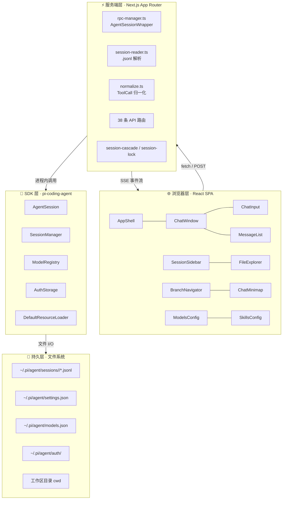
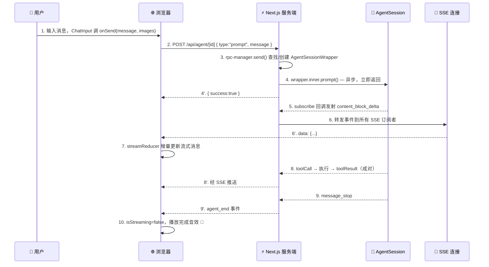
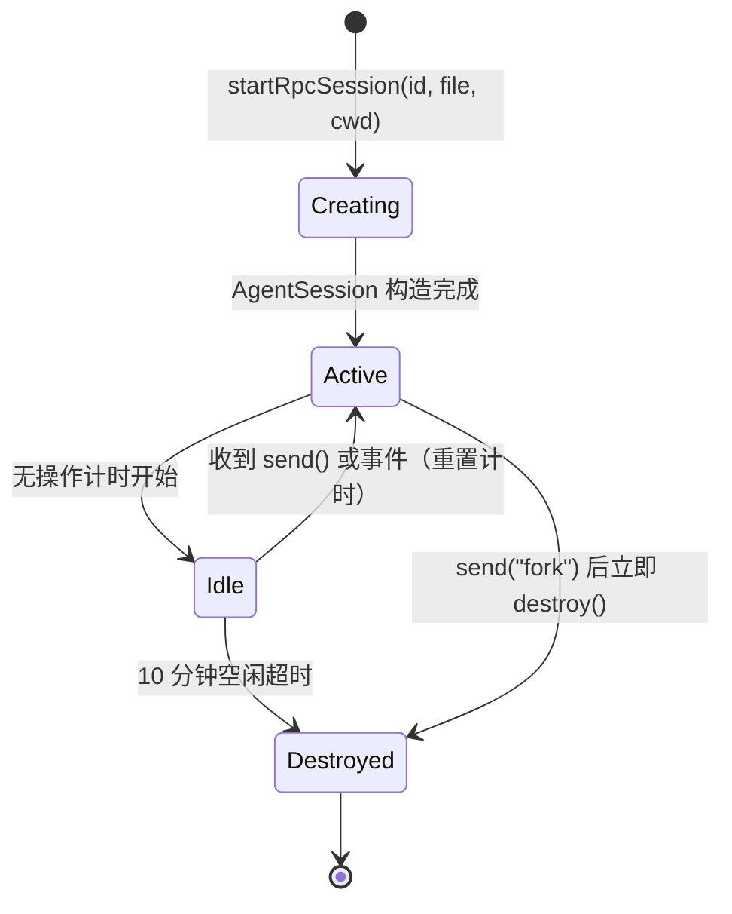

# Pi Agent Desktop · 架构深度解析

> 本文档是项目的**权威架构参考**，由 CodeGraph 静态分析 + 源码核对生成。
> 若与 `AGENTS.md` / `CLAUDE.md` 中的简要描述冲突，以本文档为准。
>
- **项目**：`@chasen-liao/pi-agent-desktop` v0.8.5
- **上游 SDK**：`@earendil-works/pi-coding-agent` ^0.84.3 / `@earendil-works/pi-ai` ^0.84.3
- **更新日期**：2026-09-01

---

## 目录

1. [设计目标](#1-设计目标)
2. [双模式运行架构](#2-双模式运行架构)
3. [四层分离架构](#3-四层分离架构)
4. [目录与文件地图](#4-目录与文件地图)
5. [核心数据流：一次对话的完整旅程](#5-核心数据流一次对话的完整旅程)
6. [两种会话访问模式](#6-两种会话访问模式)
7. [AgentSession 生命周期](#7-agentsession-生命周期)
8. [会话与分支模型](#8-会话与分支模型)
9. [Pi 会话文件格式](#9-pi-会话文件格式)
10. [组件清单](#10-组件清单)
11. [Hooks 清单](#11-hooks-清单)
12. [API 路由清单](#12-api-路由清单)
13. [Electron 桌面端](#13-electron-桌面端)
14. [关键设计决策与陷阱](#14-关键设计决策与陷阱)
15. [技术栈](#15-技术栈)
16. [当前状态与后续规划](#16-当前状态与后续规划)

---

## 1. 设计目标

Pi Agent Desktop 是 [pi coding agent](https://github.com/earendil-works/pi-coding-agent) 的桌面客户端，定位为**个人极简版 Codex**。核心目标：

- **一套 UI，两种运行模式** — 浏览器开发模式 + Electron 桌面应用模式共用同一份 Next.js / React 代码。
- **零状态库、零 UI 库** — 全部手写，仅依赖 React 内置能力（`useReducer` / `useState` / `useRef`）。
- **进程内持有 AgentSession** — 服务端不通过 IPC/RPC 调用 SDK，而是直接 `new AgentSession()`，SSE 推送零延迟。
- **原生桌面体验** — 独立窗口、系统托盘、自动更新、原生目录选择器。

---

## 2. 双模式运行架构

### Web 模式（浏览器开发）

```text
┌─────────────┐     HTTP/SSE      ┌──────────────────────┐     进程内     ┌────────────────────┐
│  Browser    │ ◀──────────────▶  │  Next.js Server      │ ◀──────────▶  │  AgentSession      │
│  (React SPA)│                   │  (App Router, :30141) │                │  (pi-coding-agent) │
└─────────────┘                   └──────────────────────┘                └────────────────────┘
```

- 启动：`npm run dev`（端口 30141）
- 浏览器 ↔ Next.js 服务端通过 REST + SSE 通信
- 服务端 ↔ AgentSession 在**同一 Node 进程内**直接调用

### Desktop 模式（Electron 生产）

```text
Pi Agent Desktop (Electron Main)
  │
  ├─ macOS: utilityProcess.fork(server.js, { PORT, HOSTNAME })
  │  Windows/Linux: spawn(process.execPath, [server.js], {
  │     env: { ELECTRON_RUN_AS_NODE=1, PORT, HOSTNAME }
  │  })
  │     └─ Next.js standalone server on 127.0.0.1:$PORT
  │
  ├─ BrowserWindow → loadURL("http://127.0.0.1:$PORT")
  │     └─ 同一份 React UI
  │
  ├─ Tray icon（最小化到托盘 / 右键退出）
  │
  └─ autoUpdater（检查 GitHub Releases）
       └─ preload.ts 暴露 electronAPI（selectDirectory / getPathForFile / update / setTheme）
```

- 启动：`npm run dev:electron`（开发）/ `npm run dist`（打包）
- Electron 主进程托管 Next.js standalone `server.js`：macOS 使用 Electron Helper `utilityProcess`（系统登记为后台 `UIElement`，不占 Dock）；Windows/Linux 继续使用 `ELECTRON_RUN_AS_NODE=1`
- 主进程开 `BrowserWindow` 指向 `http://127.0.0.1:PORT`，UI 与 Web 模式完全相同
- 子进程在 `before-quit` 时被 kill

---

## 3. 四层分离架构



| 层 | 职责 | 关键约束 |
|---|---|---|
| **浏览器层** | UI 渲染、用户交互、SSE 消费、URL 状态 | 零状态库；流式消息由 `streamReducer` 增量更新 |
| **服务端层** | API 路由、AgentSession 包装、文件解析 | 活跃 session 必须存 `globalThis`（HMR 安全） |
| **SDK 层** | 真正的 AI 对话引擎、模型调度、工具执行 | 由 `@earendil-works/pi-coding-agent` 提供 |
| **持久层** | 所有状态最终落到磁盘 `.jsonl` 文件 | append-only；header 含 `parentSession` 显示元数据 |

---

## 4. 目录与文件地图

```text
pi-agent-desktop/
├── package.json                  @chasen-liao/pi-agent-desktop v0.8.5
├── next.config.ts                output:"standalone" + server external packages
├── tailwind.config.ts            Tailwind 4 配置
├── tsconfig.json                 strict + bundler resolution
├── electron-builder.yml          Windows NSIS + macOS DMG/ZIP + Linux DEB 打包配置
├── CONTRIBUTING.md               Issue / PR / 合并约定
├── .github/workflows/            ci.yml 测试；desktop-packages.yml 打 v* 桌面包
├── .github/ISSUE_TEMPLATE/       Bug / Feature / Packaging 模板
├── eslint.config.mjs             ESLint 9 flat config
│
├── bin/
│   └── pi-web.js                 CLI 入口 → next start（npm i -g / npx）
│
├── app/                          Next.js App Router
│   ├── layout.tsx                主题初始化 + I18nProvider + 字体 + 防 FOUC 脚本
│   ├── page.tsx                  挂载 <AppShell/>
│   ├── globals.css               CSS 变量主题 + View Transitions
│   └── api/                      38 条 API 路由（见 §12）
│
├── components/                   React 组件（见 §10）
│   ├── I18nProvider.tsx          界面语言（en / zh-CN / system）
│   ├── AppShell.tsx              顶层布局
│   ├── ChatWindow.tsx            对话外壳（核心）
│   ├── ChatInput.tsx             输入栏
│   ├── AgentThinkingOrb.tsx      活跃思考状态与液态球容器
│   ├── LiquidOrbCanvas.tsx       WebGPU / Canvas 液态球渲染
│   ├── MessageList.tsx           消息列表（虚拟化）
│   ├── MessageView.tsx           单条消息渲染
│   ├── SessionSidebar.tsx        会话树侧边栏
│   ├── BranchNavigator.tsx       会话内分支切换器
│   ├── ChatMinimap.tsx           滚动缩略导航
│   ├── ToolPanel.tsx             工具预设面板
│   ├── ModelsConfig.tsx          模型配置弹窗
│   ├── SkillsConfig.tsx          技能管理弹窗
│   ├── FileExplorer.tsx          文件树
│   ├── FileViewer.tsx            文件内容查看
│   ├── FileIcons.tsx             SVG 文件图标
│   ├── TabBar.tsx                顶部标签栏
│   ├── StatsBar.tsx              统计栏
│   ├── AgentModeSelector.tsx     Plan / Ask / Full 安全模式切换器
│   ├── ExecutePlanBar.tsx        Plan 模式执行计划提示条
│   ├── ExtensionUiDialog.tsx     Extension 交互弹窗（confirm/select/input/editor）
│   ├── ProjectTrustDialog.tsx    Project Trust 授权对话框
│   ├── McpConfigModal.tsx        MCP 服务器配置与状态管理弹窗
│   ├── SessionExportModal.tsx    会话导出弹窗（HTML/Markdown）
│   ├── ExtensionsConfigModal.tsx 扩展与 Skill 统一管理弹窗
│   ├── BranchCloneModal.tsx      会话分叉与克隆对话框
│   ├── chat-input/               输入栏子组件
│   │   ├── AttachmentPreview.tsx
│   │   ├── ModelSelector.tsx
│   │   ├── PresetSelector.tsx
│   │   ├── QueuedMessageList.tsx  Follow-up Queue 重排界面
│   │   ├── submit-action.ts        Enter / Alt+Enter 动作判定
│   │   └── types.ts
│   ├── session-sidebar/          侧边栏子组件
│   │   ├── helpers.ts
│   │   ├── PiAgentTitle.tsx
│   │   ├── SessionTree.tsx
│   │   └── SidebarHeader.tsx
│   ├── models-config/            模型配置子组件
│   ├── file-viewer-virtualization.ts
│   └── FileViewer / file-viewer-virtualization .test.ts
│
├── hooks/                        React Hooks（见 §11）
│   ├── useAgentSession.ts        Agent 交互主 hook
│   ├── useTheme.ts               View Transitions 主题切换
│   ├── useAudio.ts               完成音效
│   ├── useDragDrop.ts            任意文件拖拽（路径 @mention；图片另附）
│   ├── useFileTabs.ts            文件标签管理
│   ├── usePanelLayout.ts         侧边栏宽度计算
│   └── agent-session/            useAgentSession 拆分出的子 hooks
│       ├── use-session-loader.ts
│       ├── use-agent-events.ts
│       ├── use-chat-scroll.ts
│       ├── session-loader-api.ts
│       ├── agent-events-manager.ts
│       ├── agent-event-apply.ts
│       ├── agent-phase.ts
│       ├── session-lifecycle-reset.ts
│       ├── session-stats.ts
│       ├── stream-state.ts
│       ├── use-session-commands.ts
│       └── use-session-model-tools.ts
│
├── lib/                          服务端 / 共享库
│   ├── i18n/                     界面文案：en / zh-CN 词典与 locale 解析
│   ├── rpc-manager.ts            ★ AgentSessionWrapper + 注册表 + startRpcSession
│   ├── follow-up-queue.ts        可重排 Follow-up Queue 与 revision 并发控制
│   ├── session-reader.ts         ★ .jsonl 解析 + 路径缓存 + 会话树
│   ├── approval-policy.ts        Ask 拦截规则与 AgentMode 校验
│   ├── extension-ui-bridge.ts    Extension UI Bridge 弹窗响应与通知分派
│   ├── project-trust-desktop.ts  Project Trust 409 握手与 Trust 存储
│   ├── desktop-settings.ts       桌面模式默认配置 (desktop-settings.json)
│   ├── mcp-config.ts             MCP 配置读写与测试 (~/.pi/agent/mcp.json 及 <cwd>/.pi/mcp.json)
│   ├── extensions-config.ts      扩展与 Skill 读取/开关管理
│   ├── session-export.ts         会话 HTML 与 Markdown 导出渲染器
│   ├── session-branch-clone.ts   会话 Branching & Cloning 分叉与克隆
│   ├── agent-mode-persistence.ts `.jsonl` custom 节点 desktop_agent_mode 读写
│   ├── session-cascade.ts        会话删除时子会话级联重 parent
│   ├── session-lock.ts           会话文件并发锁
│   ├── normalize.ts              ToolCall 字段归一化
│   ├── agent-client.ts           浏览器 → /api/agent/[id] 的 SSE 客户端封装
│   ├── agent-commands.ts         客户端 agent 命令帮助函数
│   ├── allowed-roots.ts          文件访问白名单鉴权（5s TTL 缓存）
│   ├── auth-policy.ts            API 鉴权策略
│   ├── path-policy.ts            路径安全检查
│   ├── skills-policy.ts          技能鉴权策略
│   ├── slash-commands.ts         客户端 / 斜杠命令解析
│   ├── types.ts                  共享 TypeScript 类型
│   ├── pi-types.ts               pi-coding-agent SDK 接口封装
│   ├── file-paths.ts             跨平台路径归一化（Windows 反斜杠→正斜杠）
│   ├── npx.ts                    安全 npx 调用（绕过 CVE-2024-27980）
│   ├── api-error.ts              API 错误格式化
│   ├── custom-path-selection.ts  自定义路径选择
│   ├── ayu-syntax-theme.ts       ayu 语法高亮主题
│   └── panel-layout.js           侧边栏宽度计算（CJS，构建兼容）
│
├── electron/                     Electron 主进程（见 §13）
│   ├── main.ts                   ★ 主进程入口
│   ├── app-icon.ts               Windows / macOS 原生图标路径选择
│   ├── preload.ts                contextBridge：目录选择、拖放路径、更新、主题、平台标记
│   ├── tray.ts                   系统托盘
│   ├── server-process.ts         ChildProcess / UtilityProcess 统一封装
│   ├── title-bar-overlay.ts      Windows 标题栏 overlay；macOS 跳过
│   ├── port-selection.ts         端口选择算法
│   ├── server-wait.ts            等待 Next.js 子进程就绪
│   ├── process-tree.ts           进程树管理
│   ├── restart-policy.ts         重启策略
│   ├── startup-failure.ts        启动失败诊断
│   ├── log-format.ts             日志格式化
│   ├── env-filter.ts             环境变量过滤
│   ├── startup.html / startup.js 启动占位页
│   ├── tsconfig.json             electron 专用 tsconfig
│   └── dist/                     tsc 输出
│
├── build/
│   ├── installer.nsh             NSIS 自定义安装脚本
│   ├── icon.ico                  Windows 应用与托盘图标
│   ├── icon.icns                 macOS 应用与托盘图标
│   └── icon.png                  Linux deb 桌面项与 hicolor 图标（512px）
│
├── docs/                         本目录
│   ├── ARCHITECTURE.md           ★ 本文档
│   ├── architecture.html         可视化架构网页
│   ├── index.html                项目介绍页
│   ├── script.js / styles.css    index.html 配套
│   └── SKILL_find_skills.md
│
├── public/                       静态资源（logo / gif / icons）
├── data/
├── release/                      electron-builder 输出
└── test/
```

---

## 5. 核心数据流：一次对话的完整旅程



**关键点**：

- `AgentSession.prompt()` 是**异步**的，调用立即返回；真正的内容由 `subscribe` 回调推送。
- SSE 是**单向推送**（服务端 → 浏览器），适合 agent 事件流；30 秒心跳防止代理超时。
- 浏览器侧 `streamReducer` 维护流式状态机（`idle → streaming → done`），仅增量更新当前流式消息，避免重渲染整列表。
- Agent 运行中，Enter 发送 steer，Alt+Enter 将消息加入 `AgentSessionWrapper` 自己维护的 `FollowUpQueue`。队列以 revision 防止陈旧重排覆盖新消息；`agent_settled` 时每次取出一条并启动下一轮，SSE `follow_up_queue_update` 保持各客户端顺序一致。Abort 会抑制本次 settled 自动派发，避免用户停止后队列意外继续。

---

## 6. 两种会话访问模式

会话浏览和交互对话走**完全不同的路径**，避免为只读操作创建重量级的 AgentSession。

| | 📖 只读浏览 | ⚡ 交互对话 |
|---|---|---|
| **触发** | 侧边栏点击会话 | 发送消息 / 恢复流式 |
| **路径** | `app/api/sessions/*` → `lib/session-reader.ts` | `app/api/agent/*` → `lib/rpc-manager.ts` |
| **是否创建 AgentSession** | ❌ 否 | ✅ 是 |
| **核心函数** | `buildSessionContext()` / `buildTree()` | `startRpcSession()` |
| **开销** | 零内存、零启动延迟 | AgentSessionWrapper + 10 分钟空闲超时 |
| **并发控制** | 文件锁 `session-lock.ts` | `globalThis.__piStartLocks` Promise 锁 |

---

## 7. AgentSession 生命周期

`lib/rpc-manager.ts` 中的 `AgentSessionWrapper` 是 SDK `AgentSession` 的进程内壳。



**进程级状态必须存 `globalThis`**（Next.js HMR 会丢弃模块级变量）：

| 全局变量 | 用途 | 定义位置 | 回收策略 |
|---|---|---|---|
| `globalThis.__piSessions` | `Map<sessionId, AgentSessionWrapper>` 活跃会话注册表 | [lib/rpc-manager.ts](../lib/rpc-manager.ts) | wrapper.destroy() 时 delete；process.once("exit") 全清 |
| `globalThis.__piSessionOnlyTrust` | `Map<sessionId, boolean>` 会话级信任状态 | [lib/rpc-manager.ts](../lib/rpc-manager.ts) | 会话信任完成或测试 reset 时清理 |
| `globalThis.__piSessionPathCacheState` | `sessionId → .jsonl` 路径与 miss 缓存 | [lib/session-reader.ts](../lib/session-reader.ts) | invalidateSessionPathEntry(id) 单条删；TTL 自动过期 |
| `globalThis.__piStartLocks` | `Map<sessionId, Promise>` 并发启动共享锁 | [lib/rpc-manager.ts](../lib/rpc-manager.ts) | startRpcSession finally 块自动清 |
| `globalThis.__piWriteLocks` | `Map<filePath, Promise>` per-file 写入锁 | [lib/session-lock.ts](../lib/session-lock.ts) | withFileLock finally 块自动清 |
| `globalThis.__piAllowedRootsCache` | `{ roots: Set<string>; expiresAt: number }` 文件访问白名单缓存（见 §14.11） | [lib/allowed-roots.ts](../lib/allowed-roots.ts) | 5s TTL 自动过期；POST /api/agent/new 时主动 add |
| `globalThis.__piLtmService` | 长期记忆 `MemoryService` 单例 | [lib/ltm/service.ts](../lib/ltm/service.ts) | 配置 key 变化时重建；测试可显式 reset |
| `globalThis.__piLoginCallbacks` | OAuth 手动输入回调注册表 | [app/api/auth/login/[provider]/route.ts](../app/api/auth/login/[provider]/route.ts) | 登录完成、取消或流结束时删除 token |
| `globalThis.__piGitWorktreeLocks` | Worktree 创建/清理的进程内锁 | [lib/git-worktree.ts](../lib/git-worktree.ts) | 操作完成后释放；键值为空时删除 |

**Fork 注册顺序陷阱**（详见 §14.2）：fork 在**文件层**通过 `SessionManager.createBranchedSession()`（或首条消息前的 `SessionManager.create()`）完成，**不修改旧 wrapper 内部状态**。但 `send("fork")` 仍需先 `startRpcSession(newSessionId, ...)` 预注册新 wrapper，再 `this.destroy()` 旧 wrapper，以满足"返回时 newSessionId 已在注册表"的契约。

---

## 8. 会话与分支模型

Pi 有两种独立的分支机制，**不要混淆**：

### Fork（跨文件分支）

- 创建**新的独立 `.jsonl` 文件**
- header 中写入 `parentSession: "/abs/path/to/parent.jsonl"`
- 侧边栏树状显示为父会话的子节点
- 触发位置：用户消息上的 Fork 按钮
- API：`POST /api/agent/[id]` body `{ type:"fork", entryId }`

### Clone 工作区（跨目录）

`POST /api/sessions/[id]/clone` 默认创建普通目录 Clone；传入 `workspaceMode: "worktree"` 时，要求源 `cwd` 位于 Git 仓库中，并在仓库外的不存在目标路径创建一个新的 Git worktree。可选 `branchName` 指定分支名；未指定时由服务端生成。成功响应的 `workspace` 会返回 `mode`、`cwd`，Worktree 还会返回 `branchName`。

Worktree 创建使用 `git worktree add --no-checkout` 后显式 checkout，并记录 worktree 的 `gitDir`、`HEAD` 与分支身份；同时在 branch reflog 写入一次随机 ownership marker，用于识别同 OID 的删除/重建。目标路径、分支和身份校验失败时会拒绝操作；Clone/fork 失败时只清理已证明属于本次创建的资源，无法证明 branch ownership 时保留 branch。

### 会话内分支（同文件分支）

- 仍在**同一个 `.jsonl` 文件**内
- 通过不同 entry 的 `parentId` 形成树
- 切换分支：`navigate_tree` 命令
- UI：`BranchNavigator` 组件可视化切换
- 上下文获取：`GET /api/sessions/[id]/context?leafId=...`

### 数据结构对应

- `entryIds[]` 与 `messages[]` 是**平行数组** —— 把 UI 显示的每条消息映射回 `.jsonl` entry id
- 用于支持 fork 与会话内导航的回溯

---

## 9. Pi 会话文件格式

**位置**：`~/.pi/agent/sessions/<encoded-cwd>/<timestamp>_<uuid>.jsonl`

```jsonl
{"type":"session","version":3,"id":"<uuid>","timestamp":"...","cwd":"/path","parentSession":"/abs/path/to/parent.jsonl"}
{"type":"model_change","id":"<8hex>","parentId":null,"provider":"zenmux","modelId":"claude-sonnet-4-6","timestamp":"..."}
{"type":"message","id":"<8hex>","parentId":"<8hex>","message":{"role":"user","content":"..."}}
{"type":"message","id":"<8hex>","parentId":"<8hex>","message":{"role":"assistant","content":[...]}}
{"type":"message","id":"<8hex>","parentId":"<8hex>","message":{"role":"toolResult","toolCallId":"...","content":[...]}}
{"type":"compaction","id":"<8hex>","parentId":"<8hex>","summary":"...","firstKeptEntryId":"<8hex>","tokensBefore":N}
{"type":"session_info","id":"...","parentId":"...","name":"user-defined name"}
{"type":"custom","id":"<8hex>","parentId":"<8hex>","timestamp":1785200000000,"customType":"desktop_agent_mode","data":{"mode":"plan"}}
```

- `parentSession` 是**显示元数据**，对聊天内容零影响；可安全 `writeFileSync` 整个文件（pi 自己的迁移也这么做）。
- `customType === "desktop_agent_mode"` 自定义节点用于持久化会话级 AgentMode (`plan`/`ask`/`full`)，`session-reader.ts` 与 `AgentSessionWrapper` 启动时自后向前扫描恢复历史模式。
- 删除会话时，`session-cascade.ts` 会把所有子会话的 `parentSession` 级联重指向到祖父会话。

---

## 10. 组件清单

> 完整清单基于 CodeGraph 索引。所有组件**手写，零 UI 库依赖**，通过 CSS 变量实现暗色/亮色主题。

### 顶层组件（27 个）

| 组件 | 职责 |
|---|---|
| `I18nProvider.tsx` | 界面语言 Context：`en` / `zh-CN` / `system`，词典在 `lib/i18n` |
| `AppShell.tsx` | 顶层布局：侧边栏 + 聊天区 + 标签页；URL `?session=` 状态；模型/技能弹窗 |
| `ChatWindow.tsx` | 对话区域外壳；委托 `useAgentSession` 处理所有 agent 交互 |
| `ChatInput.tsx` | 输入栏：模型选择、工具预设、AgentMode、Thinking Level、Steer 与 Follow-up Queue |
| `AgentThinkingOrb.tsx` | 活跃思考状态、阶段文案与液态球容器 |
| `LiquidOrbCanvas.tsx` | WebGPU 优先、Canvas 降级的液态球渲染 |
| `MessageList.tsx` | 消息列表（虚拟化滚动） |
| `MessageView.tsx` | 单条消息渲染：Markdown + Prism 高亮 + Thinking 折叠 + 工具调用配对 |
| `SessionSidebar.tsx` | 按 cwd 分组的会话树 + 内嵌 `FileExplorer` |
| `BranchNavigator.tsx` | 会话内分支切换器（线性链自动压缩，支持分叉与克隆按钮） |
| `ChatMinimap.tsx` | 消息列表右侧的滚动缩略导航 |
| `ToolPanel.tsx` | 三档工具预设：`PRESET_NONE` / `PRESET_DEFAULT` / `PRESET_FULL` |
| `ModelsConfig.tsx` | 25+ 提供商配置弹窗 |
| `SkillsConfig.tsx` | 技能搜索/安装/启用弹窗 |
| `FileExplorer.tsx` | 懒加载目录浏览，支持 `@` 引用插入 |
| `FileViewer.tsx` | 文件内容查看：代码高亮、图片、音频、Myers diff |
| `FileIcons.tsx` | 纯 SVG 单色文件图标（按扩展名匹配） |
| `TabBar.tsx` | 顶部标签栏：Chat 标签 + 多文件标签 |
| `StatsBar.tsx` | token / cost / 上下文用量统计 |
| `AgentModeSelector.tsx` | Plan / Ask / Full 三档安全模式切换控件 |
| `ExecutePlanBar.tsx` | Plan 模式生成计划后的“一键执行计划”操作条 |
| `ExtensionUiDialog.tsx` | Extension UI Bridge 交互弹窗 (confirm/select/input/editor) |
| `ProjectTrustDialog.tsx` | Project Trust 409 握手与目录信任授权弹窗 |
| `McpConfigModal.tsx` | MCP 服务器发现、在线状态、全局与项目级配置编辑弹窗 |
| `SessionExportModal.tsx` | 会话导出弹窗（支持格式与主题选择、预览与下载） |
| `ExtensionsConfigModal.tsx` | 扩展、Skill 与 MCP 服务器的多 Tab 统一管理弹窗 |
| `BranchCloneModal.tsx` | 会话节点分叉 (Branch) 与目录克隆 (Clone) 确认弹窗 |

### 子组件目录

```text
components/chat-input/
├── AttachmentPreview.tsx     图片附件预览
├── ModelSelector.tsx         模型下拉选择
├── PresetSelector.tsx        工具预设下拉
├── QueuedMessageList.tsx     Follow-up Queue 拖拽 / 键盘重排
├── submit-action.ts          Enter / Alt+Enter 动作判定
└── types.ts                  子组件共享类型

components/session-sidebar/
├── SidebarHeader.tsx         侧边栏头部
├── PiAgentTitle.tsx          Pi Agent 标题（SidebarHeader 内使用）
├── SessionTree.tsx           会话树渲染（含内部 SessionTreeItem）
└── helpers.ts                树构建辅助

components/models-config/     模型配置弹窗的子组件
```

---

## 11. Hooks 清单

### 顶层 Hooks（6 个）

| Hook | 职责 |
|---|---|
| `useAgentSession.ts` | ★ Agent 交互主 hook（加载、SSE、发送、中止、fork、导航、压缩、模型切换、工具预设） |
| `useTheme.ts` | View Transitions API 圆形擦除主题切换 |
| `useAudio.ts` | 完成音效 / 压缩音效 |
| `useDragDrop.ts` | 任意文件拖到对话区：插入 `@路径`；图片同时作为附件 |
| `useFileTabs.ts` | 文件标签页状态管理 |
| `usePanelLayout.ts` | 侧边栏 / 右侧面板宽度持久化 |

### `hooks/agent-session/` 子 Hooks / 模块（15 个）

`useAgentSession` 已按职责拆分，主 hook 组合这些子 hook：

| 子 Hook / 模块 | 职责 |
|---|---|
| `use-session-loader.ts` | 会话加载、`messages[]` / `entryIds[]` 状态 |
| `use-agent-events.ts` | SSE `EventSource` 连接管理 |
| `use-chat-scroll.ts` | 滚动容器行为（粘底、跳转到用户消息） |
| `session-loader-api.ts` | 调用 `/api/sessions/[id]` 与 `/context?leafId=` |
| `agent-events-manager.ts` | agent 事件分发到状态更新 |
| `agent-event-apply.ts` | 将单个 agent 事件归约为 UI 状态操作 |
| `agent-phase.ts` | `AgentPhase` 状态机（waiting_model / running_tool 等） |
| `session-lifecycle-reset.ts` | 会话切换时的状态重置与加载补丁 |
| `session-stats.ts` | `calculateSessionStats()` 消息统计 |
| `stream-state.ts` | `streamReducer` 流式消息状态机 |
| `use-session-commands.ts` | prompt / steer / follow-up / abort / fork 等命令 |
| `use-session-model-tools.ts` | 模型、Thinking Level 与工具预设命令 |
| `prompt-dispatch-gate.ts` | prompt / steer / follow-up 的发送门控 |
| `session-command-target.ts` | 会话命令目标解析与临时会话映射 |
| `user-message-reconciliation.ts` | 本地用户消息与服务端历史的对账去重 |

---

## 12. API 路由清单

> 共 **38** 条 `route.ts`（2026-08-03 文件系统盘点：含 LTM 5 条）。

### Agent 会话交互（3 条）

| 路由 | 方法 | 用途 |
|---|---|---|
| `app/api/agent/new/route.ts` | POST | 创建新会话并发送首条消息 |
| `app/api/agent/[id]/route.ts` | GET / POST | GET 状态；POST 命令（prompt / steer / follow_up / reorder_follow_ups / abort / fork / navigate_tree / compact / model / tools / agent mode 等） |
| `app/api/agent/[id]/events/route.ts` | GET | SSE 事件流（30s 心跳，含 Follow-up Queue、Extension UI 与运行状态事件） |

### 长期记忆 LTM（5 条）

| 路由 | 方法 | 用途 |
|---|---|---|
| `app/api/memory/health/route.ts` | GET | LTM 后端健康（`backend` / `enabled`） |
| `app/api/memory/recall/route.ts` | GET | `?cwd=&q=&limit=` 项目级检索 |
| `app/api/memory/remember/route.ts` | POST | 显式写入 memory（`cwd` + `content` + 可选 type） |
| `app/api/memory/forget/route.ts` | POST | 按 id 删除 memory / observation |
| `app/api/memory/stats/route.ts` | GET | `?cwd=` 项目记忆计数 |

实现与工具面见 `lib/ltm/`、`lib/desktop-ltm-extension.ts`；会话 JSONL 仍为独立 episodic 日志。可视化基线：[memory-architecture.html](./memory-architecture.html)；设计：[superpowers/specs/2026-08-03-long-term-memory-design.md](./superpowers/specs/2026-08-03-long-term-memory-design.md)。

### 会话浏览、分叉与导出（7 条）

| 路由 | 方法 | 用途 |
|---|---|---|
| `app/api/sessions/route.ts` | GET | 列出所有会话（按 cwd 分组） |
| `app/api/sessions/[id]/route.ts` | GET / PATCH / DELETE | 读取 / 重命名 / 删除 |
| `app/api/sessions/[id]/context/route.ts` | GET | `?leafId=` 返回指定分支叶子的上下文 |
| `app/api/sessions/[id]/branch/route.ts` | POST | 从指定 entryId 节点创建分叉新会话 (.jsonl) |
| `app/api/sessions/[id]/clone/route.ts` | POST | 全量 Clone 会话至普通目录或 Git Worktree |
| `app/api/sessions/[id]/export/route.ts` | GET | 导出会话为独立 HTML 或 Markdown 文件 |
| `app/api/sessions/new/route.ts` | — | 已弃用，返回 410 |

### MCP 服务器管理（3 条）

| 路由 | 方法 | 用途 |
|---|---|---|
| `app/api/mcp/route.ts` | GET / POST / DELETE | 读取合并配置与连线状态；新增/更新 MCP 配置；删除 MCP 配置 |
| `app/api/mcp/toggle/route.ts` | POST | 启用或禁用特定 MCP 服务器 (`disabled` 标志) |
| `app/api/mcp/test/route.ts` | POST | 测试特定 MCP 服务器配置连接与工具探针 |

### 扩展与 Skill 管理（4 条）

| 路由 | 方法 | 用途 |
|---|---|---|
| `app/api/extensions/route.ts` | GET / POST | 列出已加载扩展、Skill 及诊断信息；切换扩展/Skill 状态 |
| `app/api/skills/route.ts` | GET | 列出 / 启用 / 禁用技能 |
| `app/api/skills/search/route.ts` | POST | 搜索远程技能 |
| `app/api/skills/install/route.ts` | POST | 安装技能 |

### 桌面配置与 Trust（2 条）

| 路由 | 方法 | 用途 |
|---|---|---|
| `app/api/desktop-settings/route.ts` | GET / PUT | 读写 `~/.pi/agent/desktop-settings.json` 全局默认 AgentMode 及 ToolPreset |
| `app/api/trust/route.ts` | POST | 确认并持久化 Project Trust 信任授权决策 |

### 文件与目录（4 条）

| 路由 | 方法 | 用途 |
|---|---|---|
| `app/api/files/[...path]/route.ts` | GET / PUT | 安全文件访问：GET `?type=list\|read\|watch`（目录列表 / 文件读取 / SSE 监听变更）；PUT 写入文件。**allowed-roots 鉴权**，仅允许 session cwd 与 `~/pi-cwd-*` 下的路径（详见 §14.11） |
| `app/api/home/route.ts` | GET | 用户主目录路径 |
| `app/api/default-cwd/route.ts` | POST | 创建并返回默认项目目录 |
| `app/api/select-directory/route.ts` | POST | 原生 Windows 文件夹选择器（仅桌面端） |

### 模型配置（3 条）

| 路由 | 方法 | 用途 |
|---|---|---|
| `app/api/models/route.ts` | GET | 模型列表 + thinking levels + `defaultModel` |
| `app/api/models-config/route.ts` | GET / PUT | 读写 `~/.pi/agent/models.json` |
| `app/api/models-config/test/route.ts` | POST | 测试模型连接 |

### 认证（5 条）

| 路由 | 方法 | 用途 |
|---|---|---|
| `app/api/auth/providers/route.ts` | GET | 列出已配置的提供商 |
| `app/api/auth/all-providers/route.ts` | GET | 列出所有支持的提供商 |
| `app/api/auth/login/[provider]/route.ts` | GET / POST | OAuth 登录 |
| `app/api/auth/logout/[provider]/route.ts` | POST | 登出 |
| `app/api/auth/api-key/[provider]/route.ts` | GET / POST / DELETE | API Key 状态查询 / 保存 / 删除 |

### 其他（2 条）

| 路由 | 方法 | 用途 |
|---|---|---|
| `app/api/statusline/route.ts` | GET | git 分支与状态元数据 |
| `app/api/health/route.ts` | GET | 桌面端启动健康探测（`server-wait.ts` 调用） |
---

## 13. Electron 桌面端

### 主进程 `electron/main.ts`

职责链：

1. **端口选择**（`port-selection.ts`）— 找一个可用端口
2. **创建 `BrowserWindow`** — 先显示本地 `startup.html`
3. **启动 Next.js 子进程** — macOS 用 `utilityProcess.fork(server.js)`，Windows/Linux 用 `spawn(process.execPath, [server.js], { env: ELECTRON_RUN_AS_NODE=1 })`
4. **等待服务就绪**（`server-wait.ts`）— 打包模式必须取得 `/api/health` 成功响应；开发模式可接受 health 或 stdout `Ready`
5. **等待页面就绪**（`navigation.ts`）— `loadURL("http://127.0.0.1:PORT")` 有界重试，页面真正加载完成后才把服务标记为 `ready`
6. **托盘**（`tray.ts`）— 最小化到托盘 / 右键退出
7. **自动更新**（`autoUpdater`）— 检查 GitHub Releases

### 辅助模块

| 文件 | 职责 |
|---|---|
| `preload.ts` | `contextBridge`：`selectDirectory` / `getPathForFile` / 更新 / `setTheme` / 平台标记 |
| `app-icon.ts` | 按平台选择 `.ico` 或 `.icns` 原生图标 |
| `server-process.ts` | 统一 ChildProcess / UtilityProcess 的日志、退出、错误与进程树清理接口 |
| `title-bar-overlay.ts` | Windows `setTitleBarOverlay`；macOS 隐藏标题栏走交通灯安全区 |
| `process-tree.ts` | 杀掉子进程树（不只是直接子进程） |
| `restart-policy.ts` | 子进程崩溃后的重启策略 |
| `crash-recovery.ts` | 渲染进程崩溃（`render-process-gone`）后的有界自动重载策略 |
| `startup-failure.ts` | 启动失败诊断 UI（`startup.html`） |
| `navigation.ts` | 主页面导航的单次超时、有限重试与错误封装 |
| `port-selection.ts` | 端口选择 |
| `server-wait.ts` | 等待 Next.js 子进程就绪 |
| `csp.ts` | 内容安全策略 |
| `update-install-gate.ts` | 自动更新安装门闩 |
| `log-format.ts` | 日志格式化 |
| `env-filter.ts` | 过滤敏感环境变量传给子进程 |

### 生产环境打包布局（Windows NSIS / macOS DMG 与 ZIP / Linux DEB 内）

```
resources/
  standalone/              ← .next/standalone (extraResources)
    server.js
    node_modules/next/     ← 单独 extraResources 条目（见陷阱 §14.6）
    .next/static/
    public/
  app/
    build/                 ← icon.ico + icon.icns
  electron.asar            ← 编译后的 electron/dist/
```

---

## 14. 关键设计决策与陷阱

### 14.1 globalThis 存储会话注册表

Next.js 热重载（HMR）会丢弃模块级变量。若把 `Map<sessionId, AgentSessionWrapper>` 放在模块顶层，每次 HMR 后所有活跃 session 都会丢失。

**解决**：将这些进程级状态存到 `globalThis`（详见 §7 表格），包括会话注册/信任、路径缓存、并发锁、文件访问缓存、LTM、OAuth 回调和 Git Worktree 锁。

### 14.2 Fork 的执行顺序：预注册 → 销毁旧 wrapper

**背景**：Fork 在**文件层**完成，而非修改 wrapper 内部状态。`lib/rpc-manager.ts` 的 `case "fork"` 通过 `SessionManager.createBranchedSession(entry.parentId)`（或首条消息前的 `SessionManager.create()`）创建一个全新的 `.jsonl` 文件，然后用 `startRpcSession()` 为新文件构造一个**全新的 `AgentSession` 实例**（不是复用旧的）。

**执行顺序**（见 `lib/rpc-manager.ts` `send()` 的 `case "fork"` 分支）：

1. 读取 `entryId`，用 `SessionManager` 在磁盘上创建新 session 文件：
   - `entry.parentId === null`（首条消息前）：`SessionManager.create(cwd, sessionDir)` + `newSession({ parentSession })`
   - 否则：`SessionManager.open(currentSessionFile).createBranchedSession(entry.parentId)` 拷贝到 fork 点之前的路径
2. `cacheSessionPath(newSessionId, newSessionFile)` 缓存路径
3. **预注册**：`await startRpcSession(newSessionId, newSessionFile, newCwd)` —— 此时旧 wrapper 仍存活，新 wrapper 已进注册表
4. `this.destroy()` 销毁旧 wrapper（释放订阅、idle timer、内存；旧 wrapper 不会被自动复用，因为新请求会命中新 wrapper）
5. 返回 `{ cancelled: false, newSessionId }`

**契约**：`send()` 返回时，`newSessionId` 已在注册表中。若 `startRpcSession` 抛错，旧 wrapper **不销毁**（保持可用），孤儿新 `.jsonl` 文件可接受（下次 fork 会覆盖）。

**为什么要立即销毁旧 wrapper**：旧 wrapper 持有的 `AgentSession` 仍订阅着原 session 的事件、跑着 10 分钟 idle timer。fork 是用户"另起炉灶"的信号，旧 wrapper 不再会被请求到（后续请求走新 id），立即销毁可及时释放资源，而非等 idle 超时。

### 14.3 ToolCall 字段归一化

Pi SDK 存储格式 `{ id, name, arguments }` 与前端类型 `{ toolCallId, toolName, input }` 不一致。`normalizeToolCalls()`（`lib/normalize.ts`）在**两条路径**都做转换：

- 文件加载：`session-reader.ts` 调用
- SSE 流：`ChatWindow.handleAgentEvent()` 调用

### 14.4 两种分支机制不要混淆

见 §8。**Fork / Branch = 跨文件**，**会话内分支 = 同文件**，**Git Worktree Clone = Git 仓库外的新工作区和分支**，分别由不同 UI 入口和不同 API 触发。Worktree 清理必须先确认目标路径、分支、HEAD、linked worktree 的 `gitDir` 身份和 branch reflog ownership marker 一致；身份无法证明时应 fail closed，避免删除外部资源。Git 本身没有按 worktree identity 原子 remove 的接口，因此仍需防范非协作外部 Git 进程的极窄 TOCTOU 窗口。

### 14.5 SSE 而非 WebSocket

Agent 事件是**单向推送**（服务端 → 浏览器），SSE 天然适合，无需 WebSocket 的双向能力。

- 30 秒心跳防止代理超时
- 页面刷新时若 `state.isStreaming === true`，自动重连 SSE
- 网络断连时 `onerror` 有 1 秒自动重连

### 14.6 electron-builder extraResources 必须单独包含 node_modules

electron-builder 的 `extraResources` 带 `filter: ["**/*"]` 会**静默排除 `node_modules` 目录**，即使 `.next/standalone` 里有 `node_modules/next` 也会被漏掉。standalone `server.js` 执行 `require("next")` 会失败。

**解决**（见 `electron-builder.yml`）：

```yaml
extraResources:
  - from: .next/standalone
    to: standalone
    filter:
      - "**/*"
      - "!node_modules"
      - "!**/*.test.ts"
      - "!**/*.test.tsx"
      - "!**/*.test.mjs"
      - "!**/*.test.js"
  - from: .next/standalone/node_modules   # ← 单独条目
    to: standalone/node_modules
```

`filter: ["**/*"]` 还会把 NFT 误拆进 standalone 的 `*.test.*` 打进安装包；上面的 `!**/*.test.*` 是第二道门。第一道门是 `next.config.ts` 的 `outputFileTracingExcludes`。

### 14.7 Windows 兼容层

| 文件 | 问题 | 解决 |
|---|---|---|
| `lib/file-paths.ts` | Windows 反斜杠 | 统一正斜杠 |
| `lib/npx.ts` | `npx.cmd` shell 限制（CVE-2024-27980） | 直接 spawn，绕过 shell |
| `bin/pi-web.js` | 路径含空格 | 直接调用 next JS 入口 |

### 14.8 桌面端启动的服务与页面双门槛

冷启动时必须依次跨过两个边界，不能把 Next.js 输出 `Ready` 等同于用户已经看到主页面：

1. **服务就绪**（`server-wait.ts`）：打包模式只接受 `/api/health` 的 2xx–3xx 响应；开发模式可由 health 或 stdout `Ready` 任一信号通过。
2. **页面就绪**（`navigation.ts`）：主进程等待 `BrowserWindow.loadURL()` 完成。瞬时失败最多重试 3 次，间隔为 100 / 250 / 500ms，每次导航最长 15 秒；窗口、Next 子进程或退出状态改变时立即取消旧导航。

只有同一窗口、同一 Next 子进程的导航成功后，`serverState` 才会从 `starting` 变成 `ready`。重试耗尽时，首次启动进入错误页；自动重启阶段进入 stopped 状态并清理对应子进程，避免启动页永久转圈或旧生命周期写回 ready。

### 14.9 Compaction SSE 事件版本兼容

新版 pi 发 `compaction_start` / `compaction_end`；旧版发 `auto_compaction_start` / `auto_compaction_end`。`handleAgentEvent` 同时接受两套事件名，保持 `isCompacting` 状态同步。

### 14.10 next.config.ts 关键配置

```ts
output: "standalone"
serverExternalPackages: [
  "@earendil-works/pi-coding-agent",
  "@earendil-works/pi-ai",
]
outputFileTracingExcludes: {
  "*": [
    "release/**/*",
    ".git/**/*",
    "dist/**/*",
    "**/*.test.ts",
    "**/*.test.tsx",
    "**/*.test.mjs",
    "**/*.test.js",
    "middleware.test.ts",
    "package.test.ts",
  ],
}
```

把两个 pi 包设为 server external，避免 webpack 打包它们（它们依赖 Node 原生模块）。`outputFileTracingExcludes` 防止 NFT 把旧安装包和测试文件拆进 `.next/standalone`。

### 14.10b Next 16 Turbopack standalone 缺 app-route runtime（2026-08-03）

`next build`（Turbopack）的 NFT 可能**不**把

`next/dist/compiled/next-server/app-route-turbo.runtime.prod.js`

拷进 `.next/standalone`。打包后 Electron 子进程能起 `server.js`，但加载任意 App Route（含 `/api/health` 路径上的依赖）时报 `Cannot find module ...app-route-turbo.runtime.prod.js`，窗口一直停在启动页。

**修复**：`package.json` 的 `build:standalone` 在 `next build` 后运行

`node scripts/ensure-standalone-next-runtimes.mjs`

将所有 `*turbo*.runtime.prod.js` 从 `node_modules/next/.../next-server` 复制进 standalone。不要删掉该步骤。

### 14.10c macOS 打包架构选择：MAC_ARCH 与原生运行时对齐

macOS 打包通过 `MAC_ARCH` 环境变量选择目标架构：不设置（默认 `host`）打**当前机器架构**的单架构 DMG，可选 `arm64` / `x64` 交叉打包，或 `universal` 打双架构通用包。`mac.target` 只有 `dmg`，不再烘焙 `arch`。

Next.js NFT 只会追踪构建宿主架构的可选原生依赖。在 Apple Silicon 上生成的 `.next/standalone` 默认只有 `@img/sharp-darwin-arm64` 与对应 libvips。因此：

1. **单架构（默认）**：standalone 里另一架构的原生包是死重（libvips 一个架构约 19MB），且 Pi TUI 的 `prebuilds/darwin-{arm64,x64}` 双目录与 Clipboard 的架构兜底包同样如此。
2. **交叉打包 x64**：宿主 node_modules 里没有 x64 的 Sharp/libvips（npm 会在 Apple Silicon 上拒绝安装，EBADPLATFORM），必须用 `npm pack` 下载。
3. **universal**：双架构原生包必须并存（Sharp 按 `process.arch` 选择包）；且两份中间应用里这些文件完全相同，`@electron/universal` 会误判为需要再次 `lipo` 的同路径 Mach-O 并中止。

**修复链路**：

- `scripts/ensure-standalone-macos-runtimes.mjs` 从 standalone 的 `sharp/package.json` 读取精确可选依赖版本，按 MAC_ARCH 补齐目标架构的 Sharp 与 libvips（宿主已有则复制，缺失则 `npm pack` 下载）；单架构时**裁掉**另一架构的 Sharp/libvips、Pi TUI prebuilds 目录与 Clipboard 架构兜底包（universal 剪切板绑定双架构可用，无需处理）。
- `scripts/electron-builder-mac.mjs` 把 MAC_ARCH 映射成 electron-builder 的 `--arm64` / `--x64` / `--universal`（`host` 不传，electron-builder 默认本机架构），其余参数原样透传。`dist:mac:arm64` / `dist:mac:x64` / `dist:mac:universal` 是对应糖脚本；`universal` 时额外指定 `dmg zip` 两个 target（electron-builder CLI target 列表会覆盖 yml 的 `mac.target`），因为 macOS 自动更新（electron-updater/Squirrel.Mac）只支持 ZIP 产物，dmg-only 的包只能提示新版本、需手动下载安装。
- `electron-builder.yml` 的 `mac.x64ArchFiles` 只在 `MAC_ARCH=universal` 时被消费：匹配 standalone 与 `standalone/.next`（NFT 哈希目录；minimatch 默认不进点目录，必须显式写出 `.next`）下的 Pi TUI / Clipboard / Sharp 与 libvips 架构专用文件，让合并器从 x64 中间应用直接复制而不 `lipo`；Electron 主可执行文件等其他 Mach-O 仍正常合并。
- standalone `node_modules` 若仍含指向构建机 `node_modules` 的符号链接，`@electron/universal` 会对 x64/arm64 临时目录算出不同的 `relativePath`（同一 `semver.js` 在一边是 `../../../node_modules/...`，另一边是 `../../../../../../../../Users/runner/...`）并中止合并。`scripts/dereference-standalone-symlinks.mjs` 在打包前把**逃逸与悬空**链接处理掉（落实成文件 / 删除），但**保留解析到 standalone 树内部的相对链接**——Turbopack 在 `.next/node_modules` 下用相对链接复用顶层 pi 运行时，全量落实会让每个安装包多出约 150MB 重复文件（`ensure-standalone-pi-runtime.mjs` 内也有一层同样的防御）。
- `@electron/rebuild` 由 electron-builder 自动调用，打包脚本不得再显式运行一遍，也不需要作为顶层 devDependency。

验证不能只看构建退出码：单架构包用 `lipo -archs` 确认只含目标架构；universal 包应为 `x86_64 arm64`，并应分别用原生 arm64 与 Rosetta x64 进程加载 packaged standalone 中的 `sharp`。

### 14.11 安全文件访问：allowed-roots 鉴权模型

`app/api/files/[...path]/route.ts` 是 FileExplorer / FileViewer 的后端，直接读用户磁盘，必须防止任意路径访问。

**允许的根目录**（`getAllowedRoots()`）：

1. 所有 pi session 的 `cwd`（来自 `listAllSessions()`）
2. `~/pi-cwd-*`（`default-cwd` 端点创建的目录，命名 `pi-cwd-YYYYMMDD`）

**路径穿越防护**（`isPathAllowed()`）：

- 逐根比较：`path.resolve(target)` 必须等于某根或以 `根 + 分隔符` 为前缀，否则 403
- **Windows / POSIX 双规则**：当 target 或 root 看起来是 Windows 绝对路径（`C:\` / `\\`）时用 `path.win32` 解析并做大小写不敏感比较；否则用宿主 `path`。避免跨平台路径分隔符和盘符大小写导致的误判
- Windows 绝对路径判定：`/^[a-zA-Z]:[\\/]/` 或 `\\` / `//` 开头

**`globalThis.__piAllowedRootsCache`（5s TTL）**：每次请求都调 `listAllSessions()` 全盘扫描代价高；缓存允许根集合 5 秒，新创建的 cwd 也能 promptly 出现。必须存 globalThis 以存活 HMR（与 §14.1 同理）。

**三种 GET 模式**（`?type=`）：

| type | 行为 |
|---|---|
| `list`（默认） | 目录列表：过滤 `node_modules`/`.git`/`.next` 等 `IGNORED_NAMES` 与 `.pyc` 后缀，目录在前字母序 |
| `read` | 文件读取：图片/音频走流式 `streamFile`（支持 HTTP Range），文本返回 `{ content, language, size }` |
| `watch` | SSE：`fs.watch` 监听文件变更，发射 `change` 事件（mtime + size） |

**大小限制**：

| 场景 | 上限 | 超限返回 |
|---|---|---|
| 文本预览（read） | 256 KB | 413 |
| 文本写入（PUT） | 512 KB | 413 |
| 图片预览 | 10 MB | 413 |
| 音频流式 | 无上限（Range 分块） | — |

**`streamFile` 的连接清理**：用 `ReadableStream` 包装 `fs.createReadStream`，`cancel()` 时 `fileStream.destroy()`。浏览器媒体探针常提前断开，`controller.enqueue/close/error` 全部 try-catch 以容忍客户端已放弃的响应。

**PUT 写入**：`{ content: string }` 覆盖写文件，同样受 allowed-roots 鉴权与 512 KB 上限约束。

### 14.12 Extension UI Bridge 异步 RPC 响应队里

`lib/extension-ui-bridge.ts` 实现了 Extension UI 上下文接口。当 Extension 调用 `confirm`/`select`/`input`/`editor` 时，Bridge 分配唯一的 UUID，并通过 SSE 向前端分发 `extension_ui_request` 事件。服务端内部持有 Deferred Promise（Map 结构），前端用户交互操作产生 `extension_ui_response` 命令，精准匹配 UUID 以 resolve/reject，wrapper 销毁时自动 cancel 所有 pending 请求。

### 14.13 Project Trust 409 握手与延迟 Session 创建

在建立 Session 之前，服务端先通过 `needsProjectTrust(cwd)` 校验目标目录的信任状态。如果包含外部 Extension/Skill 配置且未经信任，服务端直接返回 HTTP 409 `needsTrust` 载荷而**拒绝开启**底层 AgentSession。前端拦截 409 弹窗请求用户确认后，调用 `POST /api/trust` 保存决策，再自动重新重试会话创建，从而保证非信任资源绝不越权加载。

### 14.14 MCP 服务器全局与项目级配置双级合并

`lib/mcp-config.ts` 负责读写全局 (`~/.pi/agent/mcp.json`) 与项目级 (`<cwd>/.pi/mcp.json`) 的 MCP 配置。通过合并算法展示并管理 Server 实例状态（如连线、工具数量、错误诊断及禁用标志 `disabled`），且修改项目级 MCP 时自动维护相应 `.pi/` 目录。

### 14.15 AgentMode `.jsonl` 持久化与末位扫描

为了让模式切换跨会话和重启保持一致，`AgentSessionWrapper` 在每次修改 AgentMode (`plan`/`ask`/`full`) 时向 `.jsonl` 追加 Custom Entry (`type: "custom"`, `customType: "desktop_agent_mode"`)。在打开会话时自后向前扫描寻找最后一个 `desktop_agent_mode` 节点，并优先以此还原 Agent 状态与 Ask 拦截规则。

### 14.16 白屏双兑底：全局错误边界与渲染进程崩溃自动重载（2026-08-28，issue #20）

Issue #20「对话进行当中突然白屏」的调研（[docs/research/issue-20-white-screen-analysis.md](research/issue-20-white-screen-analysis.md)）确认了两个结构性缺口：① 仓库无任何 React 错误边界，渲染期未捕获异常会让 React 19 卸载整棵树成白屏；② 主进程不监听 `render-process-gone`，渲染进程 OOM/GPU 崩溃后窗口永久空白。修复：

- `app/error.tsx`：全局错误边界（Next 16 约定，注意 prop 是 `retry` 不是旧版 `reset`），渲染异常降级为可重试错误卡片；`app/error.test.ts` 用源码断言锁住该约定（仿 `components/MessageView.test.ts`）。
- `electron/crash-recovery.ts`：崩溃自动重载策略 —— 60s 窗口最多 3 次，`clean-exit`/退出中跳过，镜像 `restart-policy.ts` 的纯逻辑+同名测试模式；`main.ts` 仅装配（`installCrashRecovery`）。

边界与残余风险：`error.tsx` 不包裹根 layout（Next 约定需 `global-error.tsx`，根 layout 为静态、风险低，暂未加）；上游 pi-ai 0.84.3 的 O(n²) reasoning_details 冻结（上游 issue #8648）症状是“卡住”非白屏，待上游发修复版升级。

---

## 15. 技术栈

| 类别 | 技术 | 版本 |
|---|---|---|
| 框架 | Next.js（App Router） | 16.3.2 |
| UI 库 | React | ^19.2.4 |
| 样式 | Tailwind CSS + CSS 变量 | ^4.2.2 |
| 类型 | TypeScript（strict） | ^5 |
| Markdown | react-markdown | ^10.1.0 |
| Markdown | remark-gfm | ^4.0.1 |
| 代码高亮 | react-syntax-highlighter（Prism） | ^16.1.1 |
| AI SDK | @earendil-works/pi-coding-agent | ^0.84.3 |
| AI SDK | @earendil-works/pi-ai | ^0.84.3 |
| 品牌图标 | @lobehub/icons | ^5.6.0 |
| 桌面壳 | Electron | ^43.4.1 |
| 打包 | electron-builder（Windows NSIS；macOS DMG，按 MAC_ARCH 单架构或 Universal；Linux DEB） | ^26.15.3 |
| 自动更新 | electron-updater | ^6.8.9 |
| Lint | ESLint（flat config） | ^9 |
| 测试 | node:test | 内置 |

**不使用**：状态管理库（Redux / Zustand）、UI 组件库（shadcn / MUI）、CSS-in-JS。

---

## 16. 当前状态与后续规划

### Wave 1: Codex-alignment 基石能力（已完成）
- **Agent 模式与 Ask 拦截**：Plan / Ask / Full 三模式，`ask` 模式拦截 `bash`/`write`/`edit` 并弹窗确认；Plan 模式一键执行计划。
- **Extension UI Bridge**：支持 Extension 弹窗 (`confirm`/`select`/`input`/`editor`) 与原生 Notify 通知。
- **Project Trust 409 握手**：409 响应与 ProjectTrustDialog 弹窗，信任后载入项目资源。

### Wave 2: MCP / 会话分支与导出 / 扩展管理 UI（已完成）
- **MCP 服务器配置与管理 UI**：支持全局与项目级 `mcp.json` 的读写、开启/禁用、测试连通性与工具数查看。
- **会话 Branching & Cloning**：支持从指定节点分叉 Session Branch，以及将 Session 全量 Clone 至普通目录或 Git Worktree。
- **会话导出 (HTML / Markdown)**：一键导出会话内容为原生 HTML 或 Markdown。
- **AgentMode `.jsonl` 持久化**：写入 `desktop_agent_mode` 自定义节点并在加载时自后向前恢复历史模式。
- **扩展与 Skill 统一管理**：Tab 化管理已配置的 Extensions、Skills 与 MCP 服务。

### 后续规划
- **操作系统级沙盒隔离**：Docker / OS 容器沙盒执行隔离。
- **多 Agent 协作**：在现有会话与 Worktree 基础上支持多 Agent 并行处理。

## 附录：相关文档

- [AGENTS.md](../AGENTS.md) — 开发快速上手 + 已精简的架构摘要
- [CLAUDE.md](../CLAUDE.md) — Claude Code 使用指南 + 已精简的架构摘要
- [docs/architecture.html](./architecture.html) — 可视化架构网页（浏览器打开）
- [docs/index.html](./index.html) — 项目介绍页
